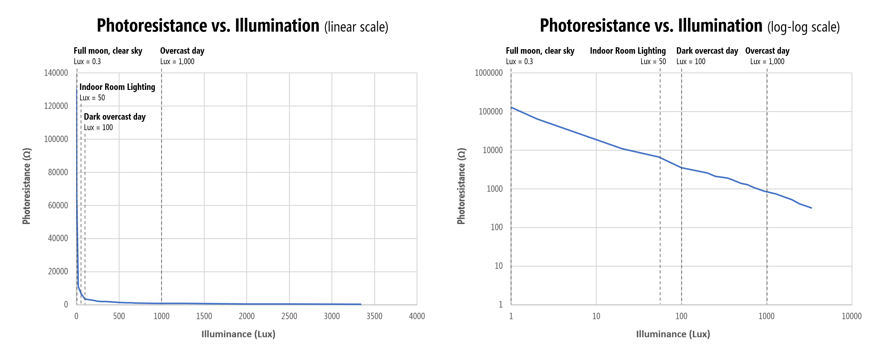
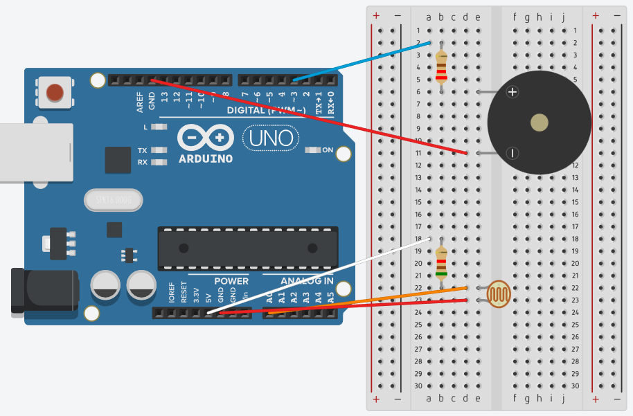

# Light based theremin

A light based theremin implemented on Arduino UNO with a photoresistor (also called **photocell** or **light-dependent resistor (LDR)**) and an active buzzer.

## Components

The components used in this project are

- Arduino UNO R3
- Breadboard
- 5 Male-Male wires
- 1 ***220Ω*** resistor
- 1 ***5.1kΩ*** resistor
- 1 Active Buzzer

### How does the photoresistor work ?

In the dark, the LDR's resistance is very high (up to 1 MΩ), but when the LDR sensor is exposed to light, the resistance drops dramatically (down to a few ohms), depending on the light intensity. In fact, the LDR'S sensitivity drops exponentially as luminosity decreases so **the LDR is most sensitive to light differences in darker environments**.

**References**: [makeabilitylab](https://makeabilitylab.github.io/physcomp/sensors/photoresistors.html) and [eepower.com](https://eepower.com/resistor-guide/resistor-types/photo-resistor/)

## Circuit Diagram

The circuit diagram below was made using ***Tinkercad***. Note that the ***220Ω*** resistor is connected to the buzzer while the ***5.1kΩ*** resistor is used in series with the LDR in a **voltage divider**.

- Buzzer is connected to PWM~3
- Voltage across the LDR is read into Analog Pin A0.

Moving our hand or a light source close to the LDR we can control the sound emitted by the buzzer.

.

## Youtube demo

The repository has a video demo of the circuit, also available on Youtube. Please check: [youtube video demo](https://youtube.com/shorts/AFjBHGkOjxY).