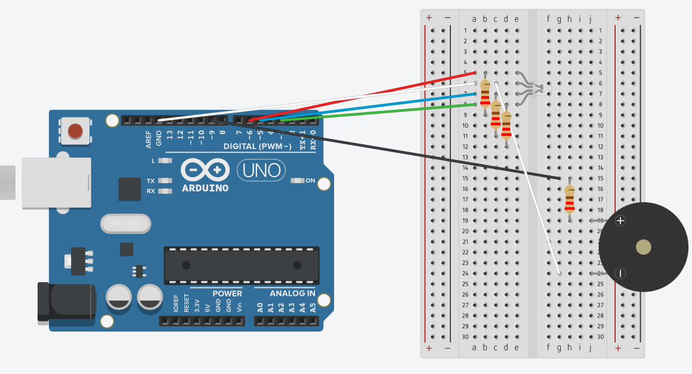

# MorseCodeTransmitter

Morse code transmitter implemented in Arduino. The text message can be configured in the ***morse.ino*** script. The circuit outputs the morse encoded message using both an RGB led and an active buzzer.

## Components

The components used in this project are

- Arduino UNO R3
- Breadboard
- 5 Male-Male wires
- 1 RGB LED
- 4 ***220Ω*** resistors
- 1 Active Buzzer

## Circuit Diagram

The circuit diagram below was made using ***Tinkercad***. Note that each LED and the buzzer are associated with their own ***220Ω*** resistor and are connected to a digital PWM output pin.

- Buzzer is connected to PWM~9
- Red LED is connected to PWM~6
- Green LED is connected to PWM~5
- Blue LED is connected to PWM~3

By varying the amount of power in these ouput pins, we can create different visual effects on the RGB LED and a sound effect on the buzzer.

.

## Youtube demo

The repository has a video demo of the circuit, also available on Youtube. Please check: [youtube video demo](https://www.youtube.com/watch?v=UgOVnKu_D5k).
