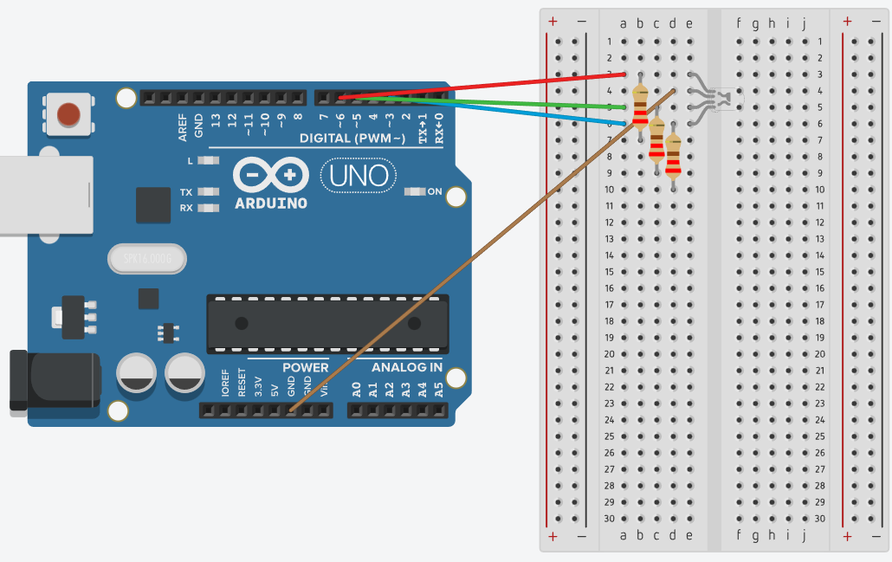

# Controlling RGB led using Arduino UNO PWM outputs

## Components

The components used in this project are

- Arduino UNO R3
- Breadboard
- 4 Male-Male wires
- 1 RGB LED
- 3 ***220Ω*** resistors

## Circuit Diagram

The circuit diagram below was made using ***Tinkercad***. Note that each LED is associated with its own ***220Ω*** resistor and is connected to a digital PWM output pin.

- Red LED is connected to PWM~6
- Green LED is connected to PWM~5
- Blue LED is connected to PWM~3

By varying the amount of power in these ouput pins, we can create different visual effects on the RGB LED.

.

## Youtube demo

The repository has a video demo of the circuit, also available on Youtube. Please check: [youtube video demo](https://youtube.com/shorts/ODwI3OPtS-A?feature=share).
